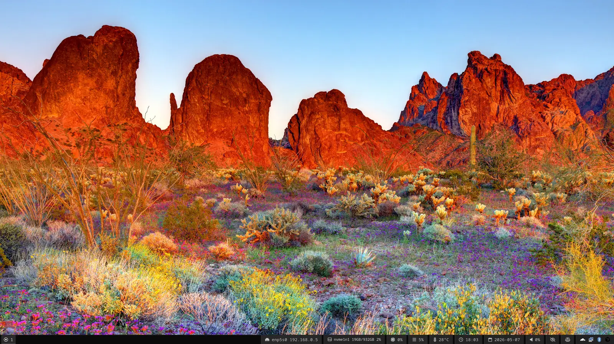

# Dotfiles

Linux desktop config — **Sway**, **Waybar**, **Alacritty**, **Vim**, plus a small bootstrap (`setup.sh`) that installs packages and links everything with **GNU Stow**.

Tested on **Fedora**, **Debian/Ubuntu**, and **Arch Linux**.

<p align="center">
  
</p>

---

## TL;DR

```bash
sudo dnf install -y git stow         # or: apt-get / pacman
git clone https://github.com/osmancoskun/dotfiles.git ~/.dotfiles
cd ~/.dotfiles
stow --restow --target="$HOME" home  # link configs into $HOME
```

Want the full bootstrap (packages, browsers, Node, Oh My Zsh, …)?

```bash
./setup.sh         # interactive menu
```

---

## Repo layout

```
.
├── home/                       # stow package — symlinked into $HOME
│   ├── .vimrc
│   └── .config/
│       ├── alacritty/          # terminal
│       ├── sway/               # window manager + wallpaper-daily, monitor layout
│       └── waybar/             # bar + custom disk / network modules
├── setup.sh                    # interactive bootstrap (single entry point)
├── lib/                        # shell modules sourced by setup.sh
├── tui/menu.sh                 # text menu rendered by setup.sh
├── scripts/setup/              # standalone helpers (wallpaper, monitors, waybar)
└── docker/                     # smoke-test dotfiles install in clean containers
```

The `home/` directory is a **stow package**: every file under it is mirrored into `$HOME` as a symlink.

---

## Just the configs (no bootstrap)

If you only want the dotfiles, clone and stow:

```bash
git clone https://github.com/osmancoskun/dotfiles.git ~/.dotfiles
cd ~/.dotfiles
stow --restow --target="$HOME" home
```

* `--restow` re-creates symlinks after `git pull`.
* If a real file is in the way, stow refuses; back it up or remove it, then re-run.

To remove the symlinks again:

```bash
stow --delete --target="$HOME" home
```

---

## `setup.sh` — interactive bootstrap

`setup.sh` is the single entry point. With no arguments it shows a numbered menu:

```
  1) Update system
  2) Repository packages (git, jq, Node.js, yarn, pnpm, …)
  3) Third-party applications (Chrome, VS Code, Cursor, Discord, …)
  4) Dotfiles & shell (Oh My Zsh, chsh to zsh)
  5) Monitors — Sway (layout / outputs)
  6) Wallpaper (Bing / NASA / Wikipedia — swaybg)
  7) Waybar config — link ~/.config/waybar from dotfiles
  Q) Quit
```

Inside any submenu, type `B` then **Enter** to go back to the main menu.

### Direct commands (no menu)

Each menu item also has a direct CLI form:

```bash
./setup.sh repo              # 2  — pick repo packages interactively
./setup.sh apps              # 3  — pick third-party apps interactively
./setup.sh dotfiles          # 4  — Oh My Zsh + chsh
./setup.sh monitors          # 5  — Sway monitor wizard (sway required)
./setup.sh wallpaper         # 6  — daily wallpaper installer
./setup.sh waybar            # 7  — link ~/.config/waybar from dotfiles
./setup.sh -h                # help
```

### Non-interactive (CI / scripts)

You can drive each step from environment variables:

```bash
REPO_APPS=git,jq,ripgrep,nodejs,yarn   ./setup.sh repo-install
DESKTOP_APPS=chrome,vscode,cursor      ./setup.sh apps-install
DOTFILES_APPS=omz,chsh                 ./setup.sh dotfiles-install
./setup.sh wallpaper-install
```

Valid keys (also listed by `./setup.sh -h`):

| Step              | Keys                                                                                                              |
|-------------------|-------------------------------------------------------------------------------------------------------------------|
| `REPO_APPS`       | `git, openssh, nc, nettools, jq, htop, ripgrep, fd, bat, zip, tree, build, dnsutils, python, nodejs, yarn, pnpm`   |
| `DESKTOP_APPS`    | `chrome, vscode, warp, cloudflared, cursor, discord`                                                              |
| `DOTFILES_APPS`   | `omz, chsh`                                                                                                       |

Logs go to **`~/setup.log`**.

> **Note:** Vendor repos (Google Chrome, Microsoft VS Code, Cursor, Cloudflare WARP, …) are added **only when you actually pick one of those apps**. Picking only repo packages won’t touch any third-party source.

---

## What gets configured

### Alacritty — `home/.config/alacritty/alacritty.toml`

Terminal config. Drop-in: install Alacritty from your distro and you’re done.

### Vim — `home/.vimrc`

Plain Vim setup, no plugin manager required.

### Sway — `home/.config/sway/`

Modular Sway config; `config.d/*` files are sourced in filename order.

| File                                  | Purpose                                                                  |
|---------------------------------------|--------------------------------------------------------------------------|
| `config`                              | Top-level sway config (loads `config.d/*`).                              |
| `config.d/10-*`                       | systemd session / cgroups integration.                                   |
| `config.d/50-rules-*`                 | Window rules (browser, pavucontrol, polkit agent).                       |
| `config.d/50-dual-monitor-layout.conf`| Hooks `apply-dual-monitor-layout.sh` after sway starts.                  |
| `config.d/60-bindings-*`              | Volume / brightness / media / screenshot keys.                           |
| `config.d/65-mode-passthrough.conf`   | Pass-through binding mode for nested compositors / VMs.                  |
| `config.d/90-bar.conf`                | Launches Waybar.                                                         |
| `config.d/90-swayidle.conf`           | Idle / lock policy.                                                      |
| `config.d/91-wallpaper-daily.conf`    | Launches `wallpaper-daily.sh --daemon` (created by step **6**).          |
| `config.d/95-*`                       | XDG autostart, polkit agent, user dirs.                                  |
| `config.d/99-background-solid.conf`   | Solid colour fallback wallpaper. *Disable if you use the daily wallpaper script.* |

#### Sway scripts — `home/.config/sway/scripts/`

* **`apply-dual-monitor-layout.sh`** — Auto-arranges a 4K (left) + 2K (right) setup with sane scales. Logs to `~/.local/state/sway-dual-monitor.log`. No arguments; just runs from the sway include. Needs `jq` + `swaymsg`.
* **`wallpaper-daily.sh`** — Daily wallpapers from **Bing**, **NASA APOD**, and/or **Wikipedia featured image**, applied via `swaybg`. Cached as `DD-MM-YYYY-<provider>.<ext>` in `WALLPAPER_DATA_DIR`.

  Subcommands:

  | Command            | Description                                                                                  |
  |--------------------|----------------------------------------------------------------------------------------------|
  | `--daemon`         | Long-running; rotates providers every `WALLPAPER_ROTATE_SEC`. Single-instance (`flock`).     |
  | `--once`           | Download today’s image from the first working provider, apply it, exit.                      |
  | `--prefetch-all`   | Download today’s image for every provider in `WALLPAPER_PROVIDERS`, then exit.               |
  | `--list-today`     | Print today’s cached paths (or fall back to newest provider files).                          |
  | `--current-path`   | Print the image path currently shown by `swaybg`.                                            |
  | `--apply FILE`     | Apply a specific image file (no download). `WALLPAPER_QUIET=1` hides the log line.           |
  | `--help`           | Show usage.                                                                                  |

  Configured via **`~/.config/sway/wallpaper-daily.env`** (created from `wallpaper-daily.env.example`):

  ```bash
  WALLPAPER_PROVIDERS=bing,nasa            # subset of: bing nasa wikipedia
  WALLPAPER_ROTATE_SEC=300                 # 0 = apply once and exit
  WALLPAPER_DATA_DIR="$HOME/.local/share/wallpapers/daily"
  WALLPAPER_PREFETCH_ALL=0                 # 1 = download all providers on first start
  NASA_API_KEY=DEMO_KEY                    # optional; avoids DEMO_KEY rate limits
  # WALLPAPER_UA_BING=...                  # browser UA if Bing returns 403
  # WALLPAPER_CURL_CONNECT_TIMEOUT, WALLPAPER_CURL_MAX_TIME, ...
  ```

  Tip: Sway loads `config.d/*` in filename order; `91-wallpaper-daily.conf` runs **before** `99-background-solid.conf`. If wallpapers never appear, the solid background is overwriting them — disable or delete `99-background-solid.conf`.

### Waybar — `home/.config/waybar/`

* **`config.jsonc`** — bar layout, modules, click cycles.
* **`style.css`** — colours / sizing.
* **`disk-mounts.sh`** — custom module: shows total/used for the currently selected disk; click cycles through disks. Tooltip is `lsblk --tree` rendered in monospace via Pango `<tt>`.

  ```bash
  ~/.config/waybar/disk-mounts.sh           # JSON for waybar
  ~/.config/waybar/disk-mounts.sh cycle     # advance the click index
  ```

  Pinned disks are listed in the `DISKS=` array at the top of the script. Removable (RM=1) disks are auto-appended when present.
* **`net-cycle.sh`** — custom module: shows iface icon + IP for the currently selected interface; click cycles. Skips `lo`, `docker*`, `veth*`, `virbr*`, etc.

Both modules require `"return-type": "json"` and `"escape": false` in `config.jsonc` — already set.

---

## Customising for your machine

### Pinned disks (waybar)

`home/.config/waybar/disk-mounts.sh`:

```bash
DISKS=(/dev/nvme1n1 /dev/nvme0n1)   # change to your block devices
```

Removable disks are picked up automatically; nothing to do for USB drives.

### Monitor layout

* **One-off / interactive:** `./setup.sh monitors` (or menu **5**) — pick orientation, scale, left-to-right order; optionally write a `config.d/` snippet.
* **Manual:** edit `home/.config/sway/config.d/50-dual-monitor-layout.conf` and `scripts/apply-dual-monitor-layout.sh`.

### Wallpapers

* **Setup once:** `./setup.sh wallpaper` (or menu **6**) — installs the env file and the sway autostart snippet.
* **Reload sway** (`Mod+Shift+c`) and the wallpaper daemon picks up changes.

---

## Project internals

You don’t need this section to use the dotfiles, but it’s useful if you want to extend `setup.sh`.

### `lib/` — sourced by `setup.sh`

| File                  | Responsibility                                                                |
|-----------------------|-------------------------------------------------------------------------------|
| `detect.sh`           | Detect distro, set `DISTRO`, `PACKAGE_MANAGER`, `INSTALL_CMD`, `UPDATE_CMD`.   |
| `packages.sh`         | `update_system`, generic `install_package`.                                   |
| `repo-packages.sh`    | Step **2** (distro repo packages). `REPO_*` arrays + interactive picker.       |
| `repos.sh`            | Vendor repo files for Chrome / VS Code / WARP / Cursor / RPM Fusion.          |
| `desktop-apps.sh`     | Step **3** (third-party apps). Adds vendor repo only for picked apps.         |
| `node.sh`             | Node.js / Yarn / pnpm helpers (used by repo-packages).                        |
| `apps.sh`             | High-level `install_*` helpers shared between steps.                          |
| `omz.sh`              | Oh My Zsh installer.                                                          |
| `shell.sh`            | `chsh` to zsh helper.                                                         |
| `dotfiles-step.sh`    | Step **4** (omz + chsh).                                                      |
| `numbered-prompt.sh`  | Numbered checklist UI shared by all picker steps.                             |
| `tui-back.sh`         | `B → main menu` exit code (`TUI_BACK_TO_MAIN`).                               |

### `tui/menu.sh`

Plain-bash menu (no `dialog`/`whiptail`). Disabled options are dimmed + struck-through if Sway is not installed.

### `scripts/setup/`

Standalone helpers callable directly (used by the menu *and* via `./setup.sh <name>`):

* `monitors.sh` — Sway monitor wizard.
* `wallpaper.sh` — Daily wallpaper installer (env + sway include + initial download).
* `wallpaper-daily.sh` — Same daemon as the stowed `~/.config/sway/scripts/wallpaper-daily.sh`; this copy is referenced by the installer for first-run behaviour.
* `wallpaper-daily.env.example` — Defaults the installer copies into `~/.config/sway/wallpaper-daily.env`.
* `waybar.sh` — Ensures `~/.config/waybar` is linked from the repo (idempotent).

### `docker/`

Smoke-tests the bootstrap on clean container images.

```bash
./docker/run-smoke.sh                  # Fedora (default)
./docker/run-smoke.sh debian           # Debian
./docker/run-smoke.sh arch             # Arch
./docker/run-smoke.sh all              # all three

# Also exercise third-party app installers:
SMOKE_APPS=cloudflared ./docker/run-smoke.sh fedora-install
./docker/run-smoke.sh debian-install   # all apps
```

The repo is mounted **read-only** at `/dotfiles`; only the container image is mutated.

---

## Requirements

| Step                              | Needs                                                |
|-----------------------------------|------------------------------------------------------|
| Stow only                         | `git`, `stow`                                        |
| `setup.sh repo`                   | sudo + your distro’s package manager                 |
| `setup.sh apps`                   | sudo, `curl` (vendor keys/repos)                     |
| `setup.sh monitors`               | `sway`, `swaymsg`, `jq`                              |
| `setup.sh wallpaper`              | `swaybg`, `curl`; `jq` for Wikipedia provider        |
| Waybar custom modules             | `python3` (JSON output); `lsblk`, `iproute2`         |
| Daily wallpaper Bing UA fix       | (optional) override `WALLPAPER_UA_BING` in env       |

---

## Updating

```bash
cd ~/.dotfiles
git pull
stow --restow --target="$HOME" home
# Reload sway: Mod+Shift+c       (or restart waybar: pkill -SIGUSR2 waybar)
```

---

## Uninstall

```bash
cd ~/.dotfiles
stow --delete --target="$HOME" home
```

This removes the symlinks; nothing else is touched.

---

## License

[WTFPL v2](LICENSE) — Do What The Fuck You Want To Public License. Personal config, no warranty.
